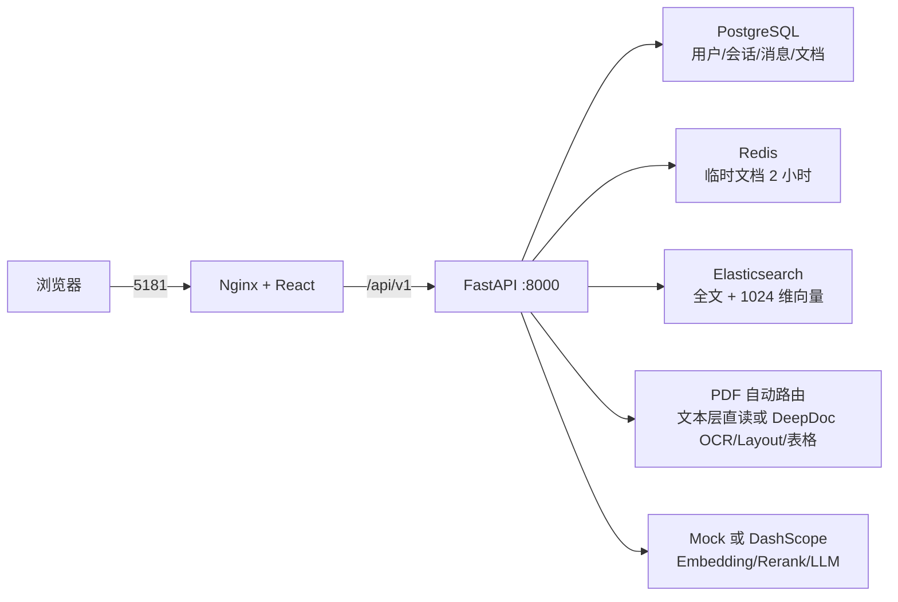

# GSK-POC 企业级智能文档问答

基于 FastAPI、React、PostgreSQL、Elasticsearch、Redis 与 DeepDoc 的完整 RAG 项目。默认使用本地 Mock 模型完成全链路演示，不消耗 DashScope 额度。

## 架构



永久知识库支持 PDF、DOCX、XLSX、TXT、Markdown、HTML。可搜索 PDF 直接提取文本层，扫描 PDF 自动进入 DeepDoc OCR、Layout 和表格结构识别，避免普通数字 PDF 无谓占用模型资源。会话临时文档支持 PDF、DOCX、TXT，单文件不超过 5 MB，同一会话后上传的文件会替换前一个文件并保存 2 小时。

## 配置与启动

1. 可选：复制 `.env.example` 为 `.env`，并替换其中的开发密码与 `JWT_SECRET_KEY`。
2. 默认保留 `MODEL_PROVIDER=mock`；真实联调时改为 `dashscope` 并配置 `DASHSCOPE_API_KEY`。
3. 在本目录执行：

```bash
docker compose up --build
```

- 前端：http://localhost:5181
- API 文档：http://localhost:8000/docs
- 健康检查：http://localhost:8000/api/v1/health

上传文件存放在 Compose 的 `uploads` 数据卷；PostgreSQL、Elasticsearch、Redis 也使用项目独立数据卷。镜像内已固定 NLTK 运行数据，不依赖宿主机挂载。

## API

| 功能 | 接口 |
|---|---|
| 注册 / 登录 | `POST /api/v1/auth/register`、`POST /api/v1/auth/login` |
| 知识库列表 / 上传 | `GET /api/v1/knowledge/documents`、`POST /api/v1/knowledge/documents` |
| 删除知识库文档 | `DELETE /api/v1/knowledge/documents/{document_id}` |
| 创建 / 获取会话 | `POST /api/v1/sessions`、`GET /api/v1/sessions` |
| 历史消息 | `GET /api/v1/sessions/{session_id}/messages` |
| 临时文档 | `PUT /api/v1/sessions/{session_id}/temporary-document` |
| 会话文档状态 | `GET /api/v1/sessions/{session_id}/documents` |
| 流式问答 | `POST /api/v1/sessions/{session_id}/chat` |

问答使用 SSE 返回 `thinking`、`answer`、`citations`、`recommendations`、`done`；失败时返回 `error`。引用从 1 开始，包含 Chunk ID、文档 ID、文档名、正文和分数。

## 验证

```bash
docker build --target test -t gsk-poc-tests ./backend/app
docker run --rm gsk-poc-tests pytest -q
```

自动化测试覆盖格式路由、PDF 文本层/扫描件分流、128 Token 目标切块、ES 映射/Bulk、混合召回、Rerank、引用、权限与事务补偿。`backend/app/tests/smoke_compose.py` 会运行时生成无隐私合成文档，验收六种永久格式、三种临时格式、SSE、历史和删除闭环；其中合成 PDF 为可搜索文本层，扫描 PDF 的 DeepDoc 模型链仍应在目标部署机器上单独做资源验收。

真实 DashScope 账号、外网连通性、线上负载和生产安全配置不在本地 Mock 验收范围内。第三方来源见 [THIRD_PARTY_NOTICES.md](THIRD_PARTY_NOTICES.md)。
